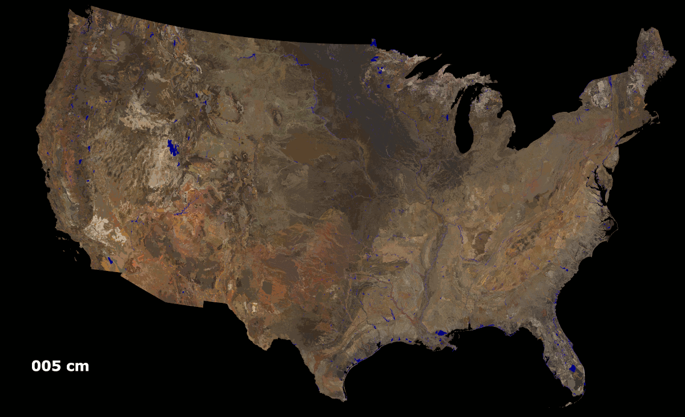

```{r setup, include=FALSE}
knitr::opts_chunk$set(echo = FALSE)
```

## 

## Problem Statement:

-   Conservation Desktop (CD) and Conservation Assessment Ranking Tool (CART) would like to present "interpretation" soil maps and tabular results based upon both soils and non-soils spatial data sources. This is not feasible with the current implementation of "Soil Data Access" (SDA) Web services.

## Why?


-   About SVI -- Nutrient Runoff
-   Identify inherent vulnerability of cropland to runoff and leaching

Why

-   Larger dead zones in the Gulf of Mexico

-   Help conservation planners identify vulnerable areas within land units for nutrient runoff

-   To support NRCS conservation planners in their work with clients. Assist conservation planners as they analyze existing resource conditions, assess site vulnerability, and formulate and evaluate alternative actions

## Code Fest experiment:

-   Combine a new data source, accessible as a "view" within the soil data mart database, with the appropriate SQL query(ies) to yield interpretation values by soil type (i.e., "map units").

-   Add additional queries to define associated colors and legends, then present the map image and tabular results in a Web page.

## Success of this experiment:

-   Opens the door to map creation for new "interpretations" that are not immediately available as part of Web Soil Survey or Soil Data Access Web applications.

## Questions?

{width="700"}
